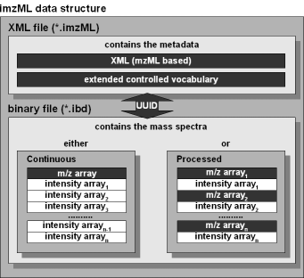

```{r style, echo=FALSE, results='asis'}
BiocStyle::markdown()
```

# Introduction 

*CardinalIO* provides fast and efficient parsing and writing of imzML files for storage of mass spectrometry (MS) imaging experiments. It is intended to take over all file importing and exporting duties for the *Cardinal* package for MS imaging data analysis. Only the most basic methods are provided here. Support for higher-level objects (e.g., `MSImagingExperiment` from *Cardinal*) should provided in their respective packages.

The __imzML__ format is an open standard for long-term storage of MS imaging experimental data. Each MS imaging dataset is composed of two files: __(1) an XML metadata file ending in ".imzML"__ that contains experimental metadata and __(2) a binary data file ending in ".ibd"__ that contains the actual m/z and intensity arrays. The files are linked by a UUID. *__Both files must be present to successfully import an MS imaging dataset.__*

The imzML specification is described in detail [here](https://ms-imaging.org/imzml/) along with example data files (two of which are included in this package). Software tools for converting vendor formats to imzML can be found [here](https://ms-imaging.org/imzml/software-tools/). A Java-based imzML validator is available [here](https://gitlab.com/imzML/imzMLValidator/-/wikis/latest). A web-based imzML validator is available [here](https://imzml.github.io).


# Installation

*CardinalIO* can be installed via the *BiocManager* package.

```{r install, eval=FALSE}
if (!require("BiocManager", quietly = TRUE))
    install.packages("BiocManager")

BiocManager::install("CardinalIO")
```

The same function can be used to update *CardinalIO* and other Bioconductor packages.

Once installed, *CardinalIO* can be loaded with `library()`:

```{r library}
library(CardinalIO)
```


# Structure of imzML files

Valid imzML datasets are composed of two files (".imzML" and ".ibd") and come in two types: "continuous" and "processed".

## XML

The XML (".imzML") file contains only human-readable experimental metadata in a structured plain text format using a controlled vocabulary. It can include many experimental details including sample preparation, instrument configuration, scan settings, etc. Note that a imzML file is also a valid mzML file, with additional requirements and constraints to accomodate the imaging modality.

## Binary

The binary data (".ibd") file contains the binary m/z and intensity arrays. The structure of these files is defined by metadata in the XML file. Two arrangements of the internal binary data arrays are possible depending on the type of imzML file ("continuous" or "processed").



## Continuous

For "continuous" imzML files, all mass spectra share the same m/z values. Therefore, the m/z array is stored only once in the binary data file.

## Processed

For "processed" imzML files, each mass spectrum has its own unique set of m/z values. Therefore, each m/z array is stored with its corresponding intensity array. This format is common for high mass resolution experiments where it would be prohibitive to store the complete profile spectrum, so the profile spectra are stored sparsely.

## Additional notes

Note that *both* imzML types may contain *either* profile *or* centroided spectra. The spectrum representation should be specified in the imzML metadata file. Further note that despite the name, the "processed" type does *not* imply that any spectral processing has been performed beyond basic processing performed by the instrument.


# Parsing imzML files

Parsing imzML files is performed with `parseImzML()`.

```{r parse}
path <- exampleImzMLFile("continuous")
path
p <- parseImzML(path, ibd=TRUE)
p
```

By default, only the ".imzML" metadata is parsed. Using `ibd=TRUE` will also attach the mass spectra (without loading them into memory).

The resulting `ImzML` object is like a list, and can be traversed in the same way using the standard `$`, `[` and `[[` operators.


## Experimental metadata

The experimental metadata is stored in a recursive list structure that closely resembles the XML hierarchy.

### File description

The `fileDescription` element contains basic information about the file's contents and provenance.

```{r fileDescription}
p$fileDescription
```

For example, the cvParam tag below indicates that this imzML file has the "continuous" storage type.

```{r fileContent-continuous}
p$fileDescription$fileContent[["IMS:1000030"]]
```

### Scan settings

If available, the `scanSettingsList` element contains a list of scan settings that should include information about the image rastering.

```{r scanSettings}
p$scanSettingsList
```

The "top down", "flyback", "horizontal line scan", and "linescan left right" terms describe the raster pattern for how the spectra were acquired.

### Software

The `softwareList` element contains information about any software that have been used with the data, including both software to control the acquisition of spectra and software to perform data processing.

```{r softwareList}
p$softwareList
```

### Instrument configuration

The `instrumentConfigurationList` element contains information about the instrument(s) used to acquire the data.

```{r instrumentConfigurationList}
p$instrumentConfigurationList
```

Each instrument configuration should include a component list that describes the ion source, mass analyzer, and detector type used.

```{r instrumentConfiguration-componentList}
p$instrumentConfigurationList$LTQFTUltra0$componentList
```

### Data processing

The `dataProcessingList` element contains information about any data processing performed and a reference to the software used to do it.

```{r dataProcessingList}
p$dataProcessingList
```


## Spectrum metadata

The spectrum metadata is the largest part of the imzML file, and therefore is not fully parsed. Many tags in this section are either repeated or unnecessary (and can be safely disregarded) or can be inferred from other tags.

Unlike the experimental metadata, the spectrum metadata are stored as data frames, with a row for each spectrum, rather than in a recursive structure like the original XML.

All data frames are stored in the `spectrumList` element inside the `run` element.

Specifically, data frames for `positions`, `mzArrays`, and `intensityArrays` are returned.

Note that no type coercion is performed for the parsed values (they are still strings), so numeric values must be coerced by the user.


### Positions

```{r spectrum-positions}
p$run$spectrumList$positions
```

The `positions` element gives the pixel x/y-coordinates for each spectrum. The z-coordinates are also available, but rarely used.


### m/z metadata

```{r spectrum-mzArrays}
p$run$spectrumList$mzArrays
```

The `mzArrays` element gives information about the locations and storage format of the m/z arrays in the ".ibd" binary data file.

Note that for a "continuous" imzML file (like the one here), each of the rows actually points to the same m/z array. For a "processed" imzML file, each row would point to a different m/z array.


### Intensity metadata

```{r spectrum-intensityArrays}
p$run$spectrumList$intensityArrays
```

The `intensityArrays` element gives information about the locations and storage format of the intensity arrays in the ".ibd" binary data file.

Note that for a "continuous" imzML file (like the one here), each of the binary data arrays has the same length. For a "processed" imzML file, each spectrum (and therefore the corresponding binary data arrays) could have a different length.


## Mass spectra

If the option `ibd=TRUE` was used when parsing the imzML file, then the mass spectra data is attached (without loading the data into memory).

```{r ibd-spectra}
p$ibd$mz
p$ibd$intensity
```

These out-of-memory lists can be subset like normal lists. They can alternatively be pulled fully into memory using `as.list()`.

```{r ibd-spectra-plot}
mz1 <- p$ibd$mz[[1L]]
int1 <- p$ibd$intensity[[1L]]
plot(mz1, int1, type="l", xlab="m/z", ylab="Intensity")
```


# Tracking experimental metadata

The `ImzML` object should not generally be modified directly.

Instead, the `ImzMeta` class provides a simplified interface to the tags required for creating a valid imzML file.

## The `ImzMeta` class

A new `ImzMeta` instance can be created with `ImzMeta()`:

```{r ImzMeta-instance}
e <- ImzMeta()
e
```

The tags can be assigned via the standard `$<-` and `[[<-` operators.

```{r ImzMeta-spectrum-assign}
e$spectrumType <- "MS1 spectrum"
e$spectrumRepresentation <- "profile"
e
```

Note that the `"profile"` value was automatically expanded to `"profile spectrum"`. Assigning to an `ImzMeta` object will attempt to match your input the correct controlled vocabulary name, where appropriate.

Trying to assign a value that can't be unambiguously matched to a valid controlled vocabulary name will yield an error message listing the allowed values.

```{r ImzMeta-spectrum-assign-error, error=TRUE}
e$spectrumType <- "spectrum"
```

At a bare minimum, `spectrumType` and `spectrumRepresentation` must be present to create a valid imzML file (in combination with the mass spectra data and their raster positions). Other fields *should* be provided, but an imzML file can still be written without them.

## Conversion between `ImzML` and `ImzMeta`

Conversion is supported between `ImzML` and `ImzMeta` objects.

Converting from `ImzMeta` to `ImzML` will keep all `ImzMeta` metadata. Sensible defaults will be assigned to required-but-missing elements.

```{r ImzMeta-to-ImzML}
p2 <- as(e, "ImzML")
p2
p2$fileDescription
```

Converting from `ImzML` to `ImzMeta` will lose any metadata that cannot be stored in the simplified `ImzMeta` object.

```{r ImzML-to-ImzMeta}
e2 <- as(p, "ImzMeta")
e2
```

Support for additional tags may be added to `ImzMeta` in the future, but some metadata loss is unavoidable due to its simplified format.

As `ImzMeta` is most useful when constructing metadata from scratch, this should not pose a problem in practice.

## Minimum reporting guidelines

Please note that `ImzMeta` does *__not__* meet minimum reporting guidelines for MS imaging experiments. Its primary purpose is to facilitate an easy interface for editing the required tags to create a valid imzML file.

For example, it does not currently support metadata for samples or sample preparation, as the `sampleList` tag is not strictly required by the imzML standard. Adding support for sample metadata would require additional ontologies that are currently outside of the scope of this package.


# Writing imzML files

Writing imzML files is performed with `writeImzML()`. This is a generic function, so methods can be written to support new classes in other packages. *CardinalIO* provides methods for `ImzML` and `ImzMeta`.

## Writing a file from `ImzML` metadata

In the simplest case, we can write a parsed imzML file back out.

```{r write-ImzML}
p
path2 <- tempfile(fileext=".imzML")
writeImzML(p, file=path2)
```

In this case, only the ".imzML" file was written and not the ".ibd", because we did not provide new mass spectra data, which will be demonstrated below.

## Writing a file from `ImzMeta` metadata

Below, we demonstrate how to write a MS imaging dataset from scratch.

First, we create some simple simulated mass spectra.

```{r create-MS-dataset}
set.seed(2023)
nx <- 3
ny <- 3
nmz <- 500
mz <- seq(500, 510, length.out=nmz)
intensity <- replicate(nx * ny, rlnorm(nmz))
positions <- expand.grid(x=seq_len(nx), y=seq_len(ny))
plot(mz, intensity[,1], type="l", xlab="m/z", ylab="Intensity")
```

Next, we create some metadata.

```{r create-ImzMeta}
meta <- ImzMeta(spectrumType="MS1 spectrum",
    spectrumRepresentation="profile",
    instrumentModel="LTQ FT Ultra",
    ionSource="electrospray ionization",
    analyzer="ion trap",
    detectorType="electron multiplier")
meta
```

Now, we can write the file using `writeImzmL()`.

```{r write-ImzMeta}
path3 <- tempfile(fileext=".imzML")
writeImzML(meta, file=path3, positions=positions, mz=mz, intensity=intensity)
```


# Session information

```{r session-info}
sessionInfo()
```


